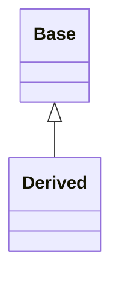
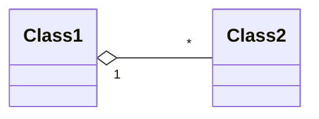
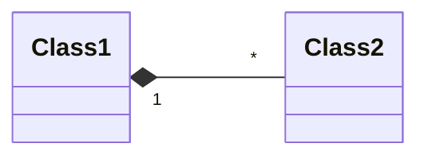
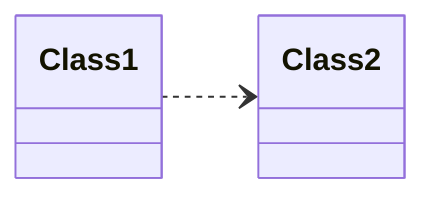
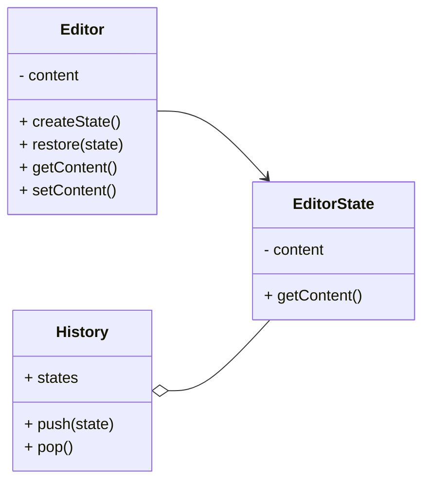
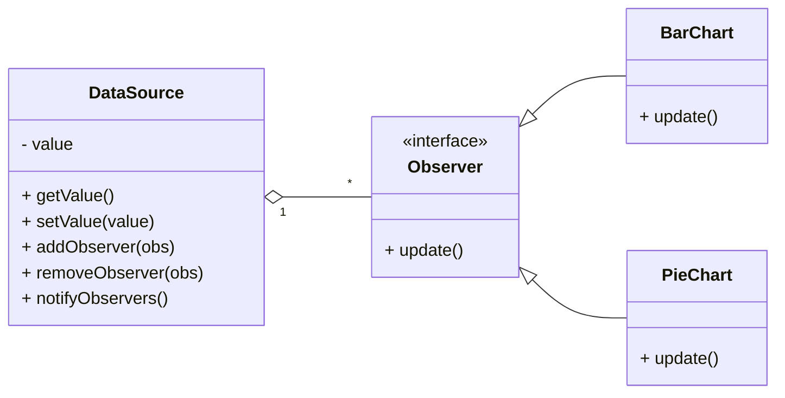

# Design Patterns Course

## Table of Contents

1. [UML Notation for Class Diagram](#uml-notation-for-class-diagram)
2. [Behavioral Design Patterns](#behavioral-design-patterns)
3. [Memento Pattern](#memento-pattern)
4. [Observer Pattern](#observer-pattern)

## UML Notation for Class Diagram

### Association

- Class1 `uses` Class2
- Association represents a relationship where one object is linked to another object.
- The association can be one-way or two-way.
- It implies that two classes are related, but neither class owns the other.


```java
class Class1 {
    void method(Class2 c2) { }
}

// Example
class Student {
    void enrollIn(Course course) { } // Student uses Course
}
```

### Inheritance

- Inheritance establishes an `is-a` relationship between the base class and the derived class.



```java
class Base { }
class Derived extends Base { }

// Example
class Animal { }
class Dog extends Animal { }
```

### Aggregation

- The containing class is said to have a `has-a` relationship with the contained class.



```java
class Class1 {
    List<Class2> c2s; // Class1 has class2s
}

// Example
class Department {
    List<Employee> employees; // Department has employees
}
```

### Composition

- The containing class is said to have a `part-of` relationship with the contained class.



```java
class Class1 {
    private Class2 c2 = new Class2(); // Class2 cannot exist without Class1
}

// Example
class House {
    private Room room = new Room(); // Room cannot exist without House
}
```

### Dependency

- Class1 `depends-on` Class2
- Exists between two classes if the changes to the definition of one may cause changes to the other (but not the other way around).
- Represented bys dashed line with an open arrow



```java
class Class1 {
    void method() {
        Class2 c3 = new Class2(); // Temporary dependency with Class2
        c2.methodFromC2();
    }
}

// Example
class OrderProcessor {
    void process(Order order) { // association with Order
        PaymentGateway gateway = new PaymentGateway(); // Temporary dependency with PaymentGateway
        gateway.charge(order.getAmount());
    }
}
```

## Design Patterns

## Behavioral Design Patterns

### Memento Pattern

- Allows restoring an object to a previous state.

#### Applicability

- Use the Memento pattern when
  - a snapshot of (some portion of) an object's state must be saved so that it can be restored to that state later, and
  - a direct interface to obtaining the state would expose implementation details
    and break the object's encapsulation.



### General Language

- Editor is called Originator
- EditorState is called Memento
- History is called Caretaker

### Create EditorState class

```java
public class EditorState {
    private final String content;

    public EditorState(String content) {
        this.content = content;
    }

    public String getContent() {
        return content;
    }
}
```

### Create Editor class

```java
public class Editor {
    private String content;

    public EditorState createState() {
        return new EditorState(content);
    }

    public void restore(EditorState state) {
        content = state.getContent();
    }

    public String getContent() {
        return content;
    }

    public void setContent(String content) {
        this.content = content;
    }
}
```

### Create History class

```java
import java.util.ArrayList;
import java.util.List;

public class History {
    private List<EditorState> states = new ArrayList<>();

    public void push(EditorState state) {
        states.add(state);
    }

    public EditorState pop() {
        var lastIndex = states.size() - 1;
        var lastState = states.get(lastIndex);
        states.remove(lastState);

        return lastState;
    }
}
```

### Create Main class

```java
public class Main {
    public static void main(String[] args) {
        var editor = new Editor();
        var history = new History();

        editor.setContent("a");
        history.push(editor.createState());


        editor.setContent("b");
        history.push(editor.createState());


        editor.setContent("c");
        System.out.println(editor.getContent());

        editor.restore(history.pop());
        System.out.println(editor.getContent());

        editor.restore(history.pop());
        System.out.println(editor.getContent());
    }
}
```

### Without Memento Pattern

- Violates Single responsibility principle

```java
import java.util.ArrayList;
import java.util.List;

public class Editor {
    private String content;
    private List<String> history = new ArrayList<>();
    private int currentIndex = -1;

    public void setContent(String content) {
        history.add(content);
        currentIndex++;
        this.content = content;
    }

    public String getContent() {
        return content;
    }

    public void undo() {
        currentIndex--;
        content = history.get(currentIndex);
    }
}

public class Main {
    public static void main(String[] args) {
        Editor editor = new Editor();
        editor.setContent("a");
        editor.setContent("b");
        editor.setContent("c");

        System.out.println(editor.getContent());

        editor.undo();
        System.out.println(editor.getContent());

        editor.undo();
        System.out.println(editor.getContent());
    }
}
```

### For supporting Redo as well

### Update History class

```java
import java.util.ArrayList;
import java.util.List;

public class History {
    private List<EditorState> undoStack = new ArrayList<>();
    private List<EditorState> redoStack = new ArrayList<>();

    public void push(EditorState state) {
        undoStack.add(state);
        redoStack.clear();
    }

    public EditorState undo() {
        var lastIndex = undoStack.size() - 1;
        var lastState = undoStack.get(lastIndex);
        undoStack.remove(lastIndex);

        redoStack.add(lastState);

        return undoStack.get(undoStack.size() - 1);
    }

    public EditorState redo() {
        var lastIndex = redoStack.size() - 1;
        var lastState = redoStack.get(lastIndex);
        redoStack.remove(lastIndex);

        undoStack.add(lastState);

        return lastState;
    }

    public EditorState pop() {
        return undo();
    }
}
```

```java
public class Main {
    public static void main(String[] args) {
        var editor = new Editor();
        var history = new History();

        editor.setContent("a");
        history.push(editor.createState());

        editor.setContent("b");
        history.push(editor.createState());

        editor.setContent("c");
        history.push(editor.createState());
        System.out.println(editor.getContent()); // c

        // Undo operations
        editor.restore(history.undo());
        System.out.println(editor.getContent()); // b

        editor.restore(history.undo());
        System.out.println(editor.getContent()); // a

        // Redo operations
        editor.restore(history.redo());
        System.out.println(editor.getContent()); // b

        editor.restore(history.redo());
        System.out.println(editor.getContent()); // c
    }
}
```

### Observer Pattern

- Allows an object notify other objects when its state changes.

### Applicability

- Use the Observer pattern in any of the following situations:
  - When a change to one object requires changing others, and you don't know how many objects need to be changed.
  - When an object should be able to notify other objects without making assumptions about who these objects are. In other words, you don't want these objects tightly coupled.



### General Language

- DataSource is called Subject
- BarChart / PieChart is called ConcreteObserver

#### Create DataSource class

```java
import java.util.ArrayList;
import java.util.List;

public class DataSource {
    private List<Observer> observers = new ArrayList<>();
    private int value;

    public int getValue() {
        return value;
    }

    public void setValue(int value) {
        this.value = value;
        notifyObservers();
    }

    public void addObserver(Observer observer) {
        observers.add(observer);
    }

    public void removeObserver(Observer observer) {
        observers.remove(observer);
    }

    public void notifyObservers() {
        for (var observer : observers)
            observer.update();
    }
}
```

#### Create Observer interface

```java
public interface Observer {
    void update();
}
```

#### Implement Concrete Observer: BarChart

```java
public class BarChart implements Observer {
    private DataSource dataSource;

    public BarChart(DataSource dataSource) {
        this.dataSource = dataSource;
    }

    @Override
    public void update() {
        System.out.println("BarChart got updated: " + dataSource.getValue());
    }
}
```

#### Implement Concrete Observer: PieChart

```java
public class PieChart implements Observer {
    private DataSource dataSource;

    public PieChart(DataSource dataSource) {
        this.dataSource = dataSource;
    }

    @Override
    public void update() {
        System.out.println("PieChart got updated: " + dataSource.getValue());
    }
}
```

#### Add Main class

```java
public class Main {
    public static void main(String[] args) {
        DataSource dataSource = new DataSource();
        BarChart barChart = new BarChart(dataSource);
        PieChart pieChart = new PieChart(dataSource);

        dataSource.addObserver(barChart);
        dataSource.addObserver(pieChart);
        dataSource.setValue(5);
        dataSource.setValue(10);

        dataSource.removeObserver(barChart);
        dataSource.setValue(15);
    }
}
```

#### Without using Observer Pattern

```java
public class DataSource {
    private int value;
    private BarChart barChart;
    private PieChart pieChart;

    public int getValue() {
        return value;
    }

    public void setValue(int value) {
        this.value = value;
        updateCharts();
    }

    public void setBarChart(BarChart barChart) {
        this.barChart = barChart;
    }

    public void setPieChart(PieChart pieChart) {
        this.pieChart = pieChart;
    }

    public void removeBarChart() {
        barChart = null;
    }

    public void removePieChart() {
        pieChart = null;
    }

    private void updateCharts() {
        if (barChart != null) {
            barChart.update(value);
        }
        if (pieChart != null) {
            pieChart.update(value);
        }
    }
}

public class BarChart {
    public void update(int value) {
        System.out.println("BarChart got updated: " + value);
    }
}

public class PieChart {
    public void update(int value) {
        System.out.println("PieChart got updated: " + value);
    }
}

public class Main {
    public static void main(String[] args) {
        DataSource dataSource = new DataSource();
        BarChart barChart = new BarChart();
        PieChart pieChart = new PieChart();

        dataSource.setBarChart(barChart);
        dataSource.setPieChart(pieChart);
        dataSource.setValue(5);
        dataSource.setValue(10);

        dataSource.removeBarChart();
        dataSource.setValue(15);
    }
}
```
