# Design Patterns Course

## Table of Contents

1. [UML Notation for Class Diagram](#uml-notation-for-class-diagram)
2. [Behavioral Design Patterns](#behavioral-design-patterns)
3. [Memento Pattern](#memento-pattern)
4. [Observer Pattern](#observer-pattern)
5. [State Pattern](#state-pattern)
6. [Iterator Pattern](#iterator-pattern)
7. [Strategy Pattern](#strategy-pattern)
8. [Command Pattern](#command-pattern)

---

---

## UML Notation for Class Diagram

### Association

- Class1 `uses` Class2
- Association represents a relationship where one object is linked to another object.
- The association can be one-way or two-way.
- It implies that two classes are related, but neither class owns the other.


```java
class Class1 {
    void method(Class2 c2) { }
}

// Example
class Student {
    void enrollIn(Course course) { } // Student uses Course
}
```

### Inheritance

- Inheritance establishes an `is-a` relationship between the base class and the derived class.

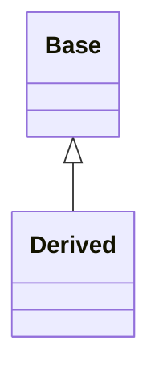

```java
class Base { }
class Derived extends Base { }

// Example
class Animal { }
class Dog extends Animal { }
```

### Aggregation

- The containing class is said to have a `has-a` relationship with the contained class.

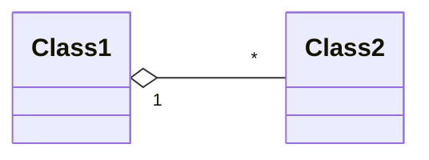

```java
class Class1 {
    List<Class2> c2s; // Class1 has class2s
}

// Example
class Department {
    List<Employee> employees; // Department has employees
}
```

### Composition

- The containing class is said to have a `part-of` relationship with the contained class.

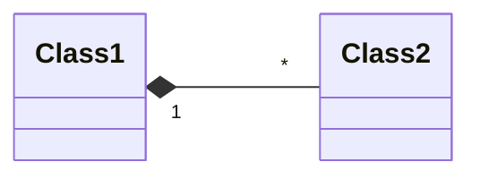

```java
class Class1 {
    private Class2 c2 = new Class2(); // Class2 cannot exist without Class1
}

// Example
class House {
    private Room room = new Room(); // Room cannot exist without House
}
```

### Dependency

- Class1 `depends-on` Class2
- Exists between two classes if the changes to the definition of one may cause changes to the other (but not the other way around).
- Represented bys dashed line with an open arrow

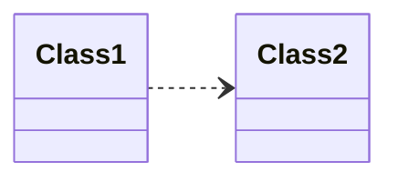

```java
class Class1 {
    void method() {
        Class2 c3 = new Class2(); // Temporary dependency with Class2
        c2.methodFromC2();
    }
}

// Example
class OrderProcessor {
    void process(Order order) { // association with Order
        PaymentGateway gateway = new PaymentGateway(); // Temporary dependency with PaymentGateway
        gateway.charge(order.getAmount());
    }
}
```

---

---

---

## Design Patterns

## Behavioral Design Patterns

### Memento Pattern

- Allows restoring an object to a previous state.

#### Applicability

- Use the Memento pattern when
  - a snapshot of (some portion of) an object's state must be saved so that it can be restored to that state later, and
  - a direct interface to obtaining the state would expose implementation details
    and break the object's encapsulation.

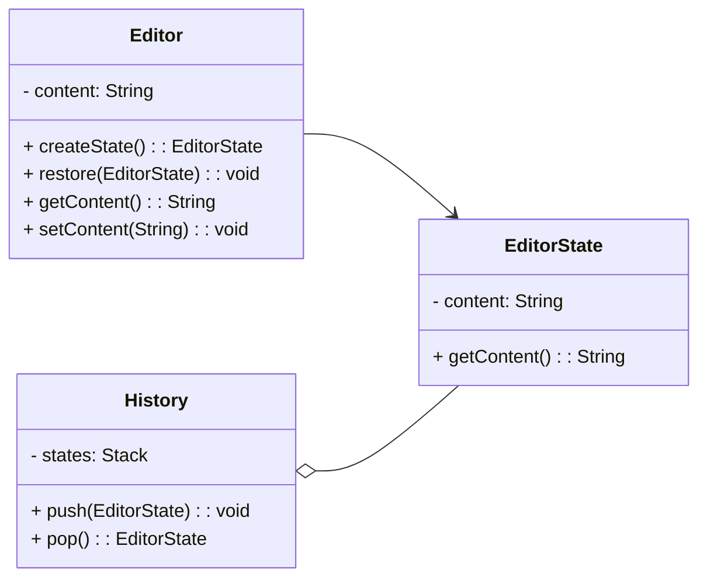

### General Vocabulary

- Editor is called Originator
- EditorState is called Memento
- History is called Caretaker

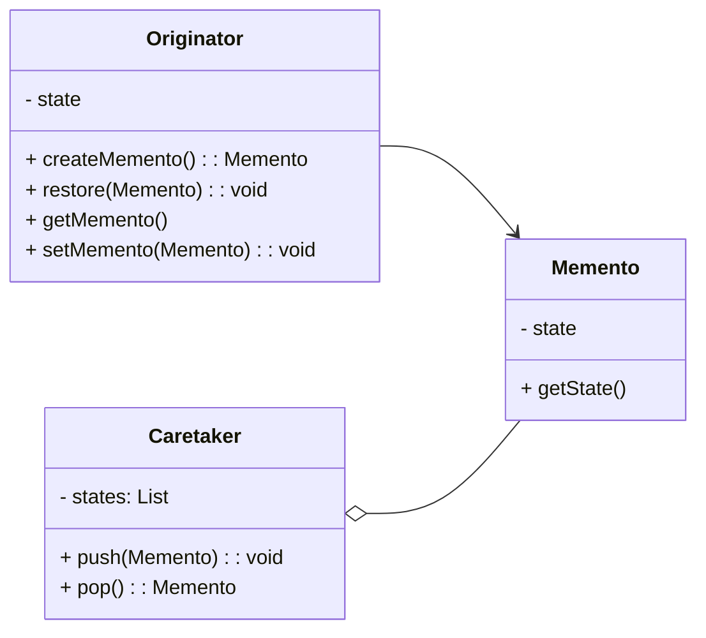

### Create EditorState class

```java
public class EditorState {
    private final String content;

    public EditorState(String content) {
        this.content = content;
    }

    public String getContent() {
        return content;
    }
}
```

### Create Editor class

```java
public class Editor {
    private String content;

    public EditorState createState() {
        return new EditorState(content);
    }

    public void restore(EditorState state) {
        content = state.getContent();
    }

    public String getContent() {
        return content;
    }

    public void setContent(String content) {
        this.content = content;
    }
}
```

### Create History class

```java
import java.util.Stack;

public class History {
    private Stack<EditorState> history = new Stack<>();

    public void push(EditorState state) {
        history.push(state);
    }

    public EditorState pop() {
        history.pop();
        return history.peek();
    }
}
```

### Create Main class

```java
public class Main {
    public static void main(String[] args) {
        var editor = new Editor();
        var history = new History();

        editor.setContent("a");
        history.push(editor.createState());

        editor.setContent("b");
        history.push(editor.createState());

        editor.setContent("c");
        history.push(editor.createState());

        System.out.println(editor.getContent());

        editor.restore(history.pop());
        System.out.println(editor.getContent());

        editor.restore(history.pop());
        System.out.println(editor.getContent());
    }
}
```

### Without Memento Pattern

- Violates Single responsibility principle

```java
import java.util.Stack;

public class Editor {
    private String content;
    private Stack<String> history = new Stack<>();

    public void setContent(String content) {
        history.push(content);
        this.content = content;
    }

    public String getContent() {
        return content;
    }

    public void undo() {
        history.pop();
        content = history.peek();
    }
}

public class Main {
    public static void main(String[] args) {
        Editor editor = new Editor();
        editor.setContent("a");
        editor.setContent("b");
        editor.setContent("c");

        System.out.println(editor.getContent());

        editor.undo();
        System.out.println(editor.getContent());

        editor.undo();
        System.out.println(editor.getContent());
    }
}
```

### For supporting Redo as well

### Update History class

```java
import java.util.Stack;

public class History {
    private Stack<EditorState> undoStack = new Stack<>();
    private Stack<EditorState> redoStack = new Stack<>();

    public void push(EditorState state) {
        undoStack.push(state);
        redoStack.clear();
    }

    public EditorState popFromUndo() {
        var lastState = undoStack.pop();
        redoStack.push(lastState);
        return undoStack.peek();
    }

    public EditorState popFromRedo() {
        var lastState = redoStack.pop();
        undoStack.push(lastState);
        return lastState;
    }
}
```

### Update Main class

```java
public class Main {
    public static void main(String[] args) {
        var editor = new Editor();
        var history = new History();

        editor.setContent("a");
        history.push(editor.createState());

        editor.setContent("b");
        history.push(editor.createState());

        editor.setContent("c");
        history.push(editor.createState());
        System.out.println(editor.getContent()); // c

        // Undo operations
        editor.restore(history.popFromUndo());
        System.out.println(editor.getContent()); // b

        editor.restore(history.popFromUndo());
        System.out.println(editor.getContent()); // a

        // Redo operations
        editor.restore(history.popFromRedo());
        System.out.println(editor.getContent()); // b

        editor.restore(history.popFromRedo());
        System.out.println(editor.getContent()); // c
    }
}
```

---

---

---

### Observer Pattern

- Allows an object notify other objects when its state changes.

### Applicability

- Use the Observer pattern in any of the following situations:
  - When a change to one object requires changing others, and you don't know how many objects need to be changed.
  - When an object should be able to notify other objects without making assumptions about who these objects are. In other words, you don't want these objects tightly coupled.

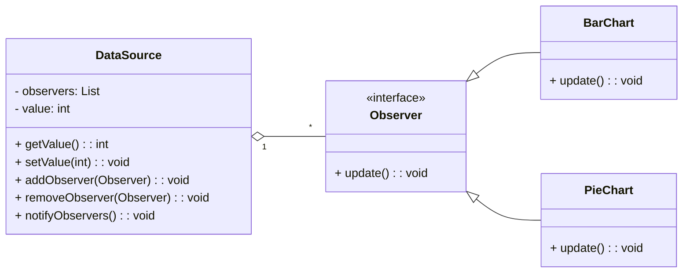

### General Vocabulary

- DataSource is called Subject
- BarChart / PieChart is called ConcreteObserver

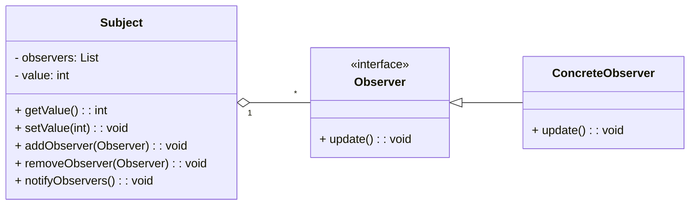

#### Create DataSource class

```java
import java.util.ArrayList;
import java.util.List;

public class DataSource {
    private List<Observer> observers = new ArrayList<>();
    private int value;

    public int getValue() {
        return value;
    }

    public void setValue(int value) {
        this.value = value;
        notifyObservers();
    }

    public void addObserver(Observer observer) {
        observers.add(observer);
    }

    public void removeObserver(Observer observer) {
        observers.remove(observer);
    }

    public void notifyObservers() {
        for (var observer : observers)
            observer.update();
    }
}
```

#### Create Observer interface

```java
public interface Observer {
    void update();
}
```

#### Implement Concrete Observer: BarChart

```java
public class BarChart implements Observer {
    private DataSource dataSource;

    public BarChart(DataSource dataSource) {
        this.dataSource = dataSource;
    }

    @Override
    public void update() {
        System.out.println("BarChart got updated: " + dataSource.getValue());
    }
}
```

#### Implement Concrete Observer: PieChart

```java
public class PieChart implements Observer {
    private DataSource dataSource;

    public PieChart(DataSource dataSource) {
        this.dataSource = dataSource;
    }

    @Override
    public void update() {
        System.out.println("PieChart got updated: " + dataSource.getValue());
    }
}
```

#### Add Main class

```java
public class Main {
    public static void main(String[] args) {
        DataSource dataSource = new DataSource();
        BarChart barChart = new BarChart(dataSource);
        PieChart pieChart = new PieChart(dataSource);

        dataSource.addObserver(barChart);
        dataSource.addObserver(pieChart);
        dataSource.setValue(5);
        dataSource.setValue(10);

        dataSource.removeObserver(barChart);
        dataSource.setValue(15);
    }
}
```

#### Without using Observer Pattern

```java
public class DataSource {
    private int value;
    private BarChart barChart;
    private PieChart pieChart;

    public int getValue() {
        return value;
    }

    public void setValue(int value) {
        this.value = value;
        updateCharts();
    }

    public void setBarChart(BarChart barChart) {
        this.barChart = barChart;
    }

    public void setPieChart(PieChart pieChart) {
        this.pieChart = pieChart;
    }

    public void removeBarChart() {
        barChart = null;
    }

    public void removePieChart() {
        pieChart = null;
    }

    private void updateCharts() {
        if (barChart != null) {
            barChart.update(value);
        }
        if (pieChart != null) {
            pieChart.update(value);
        }
    }
}

public class BarChart {
    public void update(int value) {
        System.out.println("BarChart got updated: " + value);
    }
}

public class PieChart {
    public void update(int value) {
        System.out.println("PieChart got updated: " + value);
    }
}

public class Main {
    public static void main(String[] args) {
        DataSource dataSource = new DataSource();
        BarChart barChart = new BarChart();
        PieChart pieChart = new PieChart();

        dataSource.setBarChart(barChart);
        dataSource.setPieChart(pieChart);
        dataSource.setValue(5);
        dataSource.setValue(10);

        dataSource.removeBarChart();
        dataSource.setValue(15);
    }
}
```

---

---

---

### State Pattern

- Allows an object to behave differently depending on the state it is in.

### Applicability

- Use the State pattern in any of the following situations:
  - An object's behavior depends on its state, and it must change its behavior at run-time depending on that state.
  - Operations have large, multipart conditional statements that depend on the object's state

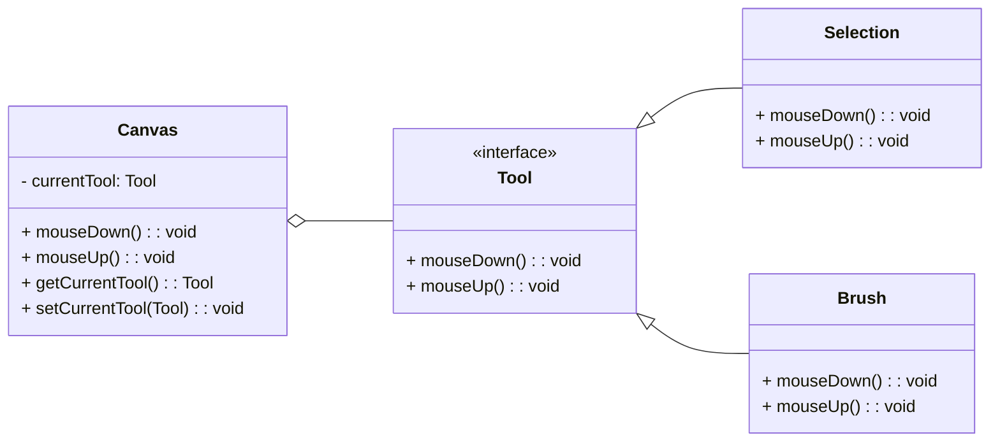

### General Vocabulary

- Canvas is called Context
- Tool is called State
- Selection / Brush is called ConcreteState

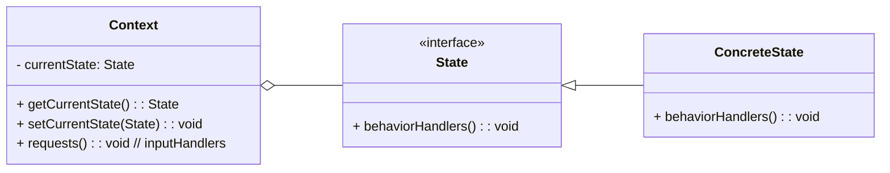

#### Create Tool interface

```java
public interface Tool {
  void mouseDown();
  void mouseUp();
}
```

#### Create Canvas class

```java
public class Canvas {
  private Tool currentTool;

  public void mouseDown() {
    currentTool.mouseDown();
  }

  public void mouseUp() {
    currentTool.mouseUp();
  }

  public Tool getCurrentTool() {
    return currentTool;
  }

  public void setCurrentTool(Tool currentTool) {
    this.currentTool = currentTool;
  }
}
```

#### Implement Concrete Tool: Pen Tool

```java
public class PenTool implements Tool {
  @Override
  public void mouseDown() {
    System.out.println("Pen icon");
  }

  @Override
  public void mouseUp() {
    System.out.println("Draw a line");
  }
}
```

#### Implement Concrete Tool: Selection Tool

```java
public class SelectionTool implements Tool {
  @Override
  public void mouseDown() {
    System.out.println("Selection icon");
  }

  @Override
  public void mouseUp() {
    System.out.println("Draw a dashed rectangle");
  }
}
```

#### Add Main class

```java
public class Main {
    public static void main(String[] args) {
        var canvas = new Canvas();
        canvas.setCurrentTool(new PenTool());
        canvas.mouseDown();
        canvas.mouseUp();
        canvas.setCurrentTool(new SelectionTool());
        canvas.mouseDown();
        canvas.mouseUp();
    }
}
```

#### Without using State Pattern

- Violates Open for extension, Closed for modification principle
- Violates Single responsibility principle

```java
class Canvas {
    private String currentTool;

    public void mouseDown() {
        if (currentTool == "pen") {
            System.out.println("Pen icon");
        } else if (currentTool == "selection") {
            System.out.println("Selection icon");
        }
    }

    public void mouseUp() {
        if (currentTool == "pen") {
            System.out.println("Draw a line");
        } else if (currentTool == "selection") {
            System.out.println("Draw a dashed rectangle");
        }
    }

    public String getCurrentTool() {
        return currentTool;
    }

    public void setCurrentTool(String currentTool) {
        this.currentTool = currentTool;
    }
}

public class Main {
    public static void main(String[] args) {
        var canvas = new Canvas();
        canvas.setCurrentTool("pen");
        canvas.mouseDown();
        canvas.mouseUp();
        canvas.setCurrentTool("selection");
        canvas.mouseDown();
        canvas.mouseUp();
    }
}
```

---

---

---

### Iterator Pattern

- Allows iterating over an object without having to expose the object’s internal data structure (which may change in the future).

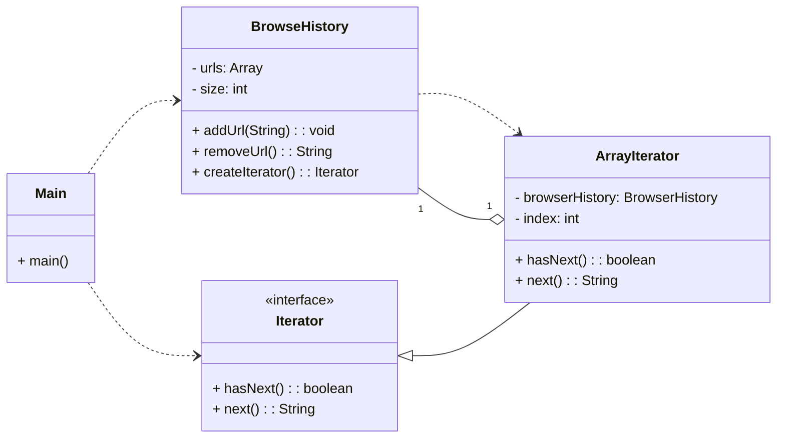

### General Vocabulary

- BrowseHistory is called Aggregate
- ArrayIterator is called ConcreteIterator
- Main is called Client

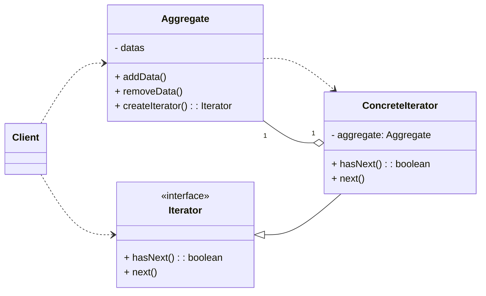

#### Create Iterator interface

```java
public interface Iterator {
    boolean hasNext();
    String next();
}
```

#### Create BrowseHistory class and nested ArrayIterator class

```java
public class BrowseHistory {
    private String[] urls = new String[10];
    private int size = 0;

    public void addUrl(String url) {
        urls[size++] = url;
    }

    public String removeUrl() {
        return urls[--size];
    }

    public Iterator createIterator() {
        return new ArrayIterator(this);
    }

    public class ArrayIterator implements Iterator {
        private BrowseHistory url;
        private int index = 0;

        public ArrayIterator(BrowseHistory url) {
            this.url = url;
        }

        @Override
        public boolean hasNext() {
            return index < url.size;
        }

        @Override
        public String next() {
            return url.urls[index++];
        }
    }
}
```

#### Add Main class

```java
public class Main {
    public static void main(String[] args) {
        var history = new BrowseHistory();
        history.addUrl("apple.com");
        history.addUrl("fb.com");
        history.addUrl("instagram.com");

        Iterator iterator = history.createIterator();
        while (iterator.hasNext()) {
            String url = iterator.next();
            System.out.println(url);
        }
    }
}
```

#### Change BrowseHistory urls' Data Structure to List

```java
import java.util.ArrayList;
import java.util.List;

public class BrowseHistory {
    private List<String> urls = new ArrayList<>();

    public void addUrl(String url) {
        urls.add(url);
    }

    public String removeUrl() {
        return urls.remove(urls.size() - 1);
    }

    public Iterator createIterator() {
        return new ListIterator(this);
    }

    public class ListIterator implements Iterator {
        private BrowseHistory browseHistory;
        private int index = 0;

        public ListIterator(BrowseHistory browseHistory) {
            this.browseHistory = browseHistory;
        }

        @Override
        public boolean hasNext() {
            return index < browseHistory.urls.size();
        }

        @Override
        public String next() {
            return browseHistory.urls.get(index++);
        }
    }
}
```

##### Why interace instead of implementing hasnext(), next() methods directly inside BrowseHistory?

- With direct methods in the aggregate, you can only have ONE iteration at a time.

```java
// BAD: Direct implementation in aggregate
var history = new BrowseHistory();
// Only ONE position tracker in the class
history.next(); // moves position to 1
history.next(); // moves position to 2

// Can't have multiple iterations simultaneously
```

- With separate iterators, you can have multiple independent iterations supporting thread safety. (Current way)

```java
// GOOD: Iterator pattern
var history = new BrowseHistory();
Iterator iterator1 = history.createIterator();
Iterator iterator2 = history.createIterator();

iterator1.next(); // iterator1 at position 1, iterator2 still at 0
iterator2.next(); // iterator2 at position 1, iterator1 still at 1
```

##### Why nested Concrete Iterator?

- The inner class doesn't pollute the global namespace.
- In a package, You can have many Aggregate class that may need same name ArrayIterator.

#### Without using Iterator Pattern

#### Using List

```java
import java.util.ArrayList;
import java.util.List;

public class BrowseHistory {
    private List<String> urls = new ArrayList<>();

    public void addUrl(String url) {
        urls.add(url);
    }

    public String removeUrl() {
        return urls.remove(urls.size() - 1);
    }

    public List<String> getUrls(){
        return urls;
    }
}

public class Main {
    public static void main(String[] args) {
        var history = new BrowseHistory();
        history.addUrl("apple.com");
        history.addUrl("fb.com");
        history.addUrl("instagram.com");

        for(int i=0; i<history.getUrls().size(); i++){
            System.out.println(history.getUrls().get(i));
        }
    }
}
```

#### Using Array

```java
public class BrowseHistory {
    private String[] urls = new String[10];
    private int size = 0;

    public void addUrl(String url) {
        urls[size++] = url;
    }

    public String removeUrl() {
        return urls[--size];
    }

    public String[] getUrls(){
        return urls;
    }

    public int getSize(){
        return size;
    }
}

public class Main {
    public static void main(String[] args) {
        var history = new BrowseHistory();
        history.addUrl("apple.com");
        history.addUrl("fb.com");
        history.addUrl("instagram.com");

        for(int i=0; i<history.getSize(); i++){
            System.out.println(history.getUrls()[i]);
        }
    }
}
```

#### Disadvantage

- Encapsulation Violation as Client code must know the internal implementation details of size and urls
- Tight Coupling as Changes to the internal structure (e.g., switching from array to LinkedList) would break all client code

---

---

---

### Strategy Pattern

- Allows passing different algorithms (behaviors) to an object.
- Makes algorithm interchangeable.
- Allows defining a template (skeleton) for an operation. Specific steps will then
  be implemented in subclasses.

### Applicability

- Use the Strategy pattern in any of the following situations:
  - You need different variants of an algorithm. For example, Photoshop requires many compression algorithm depending type of image and image compression ratio requirement of user. Also may require different filters like black & white filter, high contrast filter, etc.
  - Algorithm uses data that clients shouldn't know about. Use the Strategy pattern to avoid exposing complex, algorithm-specific data structures.
  - A class defines many behaviors, and these appear as multiple conditional statements in its operations. Instead of many conditionals, move related conditional branches into their own Strategy class.

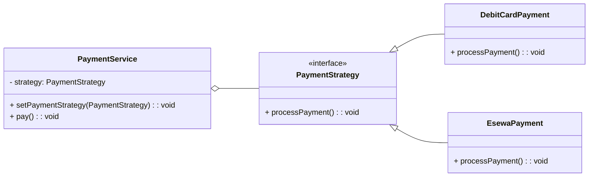

### General Vocabulary

- PaymentService is called Context
- PaymentStrategy is called Strategy
- DebitCardPayment / EsewaPayment is called ConcreteStrategy

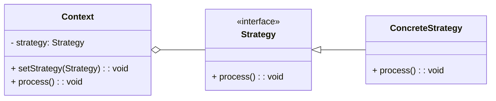

#### Create PaymentStrategy interface

```java
public interface PaymentStrategy {
  void processPayment();
}
```

#### Create PaymentService class

```java
public class PaymentService {
  private PaymentStrategy strategy;

  public void setPaymentStrategy(PaymentStrategy strategy){
      this.strategy = strategy;
  }

  public void pay(){
      strategy.processPayment(); //Polymorphic Behavior
  }
}
```

#### Implement Concrete PaymentStrategy: DebitCardPayment

```java
public class DebitCardPayment implements PaymentStrategy {
    @Override
    public void processPayment() {
        System.out.println("Making payment via Debit Card");
    }
}
```

#### Implement Concrete PaymentStrategy: EsewaPayment

```java
public class EsewaPayment implements PaymentStrategy {
    @Override
    public void processPayment() {
        System.out.println("Making payment via Esewa");
    }
}
```

#### Add Main class

```java
public class Main {
    public static void main(String[] args) {
        PaymentService paymentService = new PaymentService();
        paymentService.setPaymentStrategy(new EsewaPayment());
        paymentService.pay();
    }
}
```

#### Without using Strategy Pattern

- Violates Open for extension, Closed for modification principle
- Violates Dependency Inversion Principle (DIP); High-level module `PaymentService` depends directly on low-level details (if-else implementation of Credit Card, Debit Card, Esewa).
- Violates Single responsibility principle

```java
public class PaymentService{
    public void processPayment(String paymentMethod){
        if(paymentMethod.equals("Credit Card")){
            System.out.println("Making payment via credit card");
        }
        else if(paymentMethod.equals("Debit Card")){
            System.out.println("Making payment via debit card");
        }
        else if(paymentMethod.equals("Esewa")){
            //huge algorithm
            System.out.println("Making payment via Esewa");
        }
        else{
            System.out.println("Unsupported Payment method");
        }
    }
}

public class Main {
    public static void main(String[] args) {
        PaymentService paymentService = new PaymentService();
        paymentService.processPayment("Esewa");
    }
}
```

---

---

---

### Command Pattern

- Allows decouple a sender from a receiver. The sender will talk to the receive through a command.
- Commands can be undone and persisted.
- Encapsulate a request as an object, thereby letting you parameterize clients with
  different requests, queue or log requests, and support undoable operations.

#### Applicability

- Use the Command pattern when
  - Callback function is a function that's registered somewhere to be called at a later point. Commands are an object-oriented replacement for callbacks
  - Specify, queue, and execute requests at different times.
  - Support undo. TheCommand's Execute operation can store state for reversing its effects in the command itself
  - Support logging changes so that they can be reapplied in case of a system crash.


### General Vocabulary

- Button is called Invoker
- CustomerService is called Receiver
- AddCustomer is called ConcreteCommand


### Create Command interface

```java
public interface Command {
  void execute();
}
```

### Create Button class

```java
public class Button {
  private String label;
  private Command command;

  public Button(Command command) {
    this.command = command;
  }

  public void click() {
    command.execute();
  }

  public String getLabel() {
    return label;
  }

  public void setLabel(String label) {
    this.label = label;
  }
}
```

### Create CustomerService class

```java
public class CustomerService {
    public void addCustomer() {
        System.out.println("Add Customer");
    }
}
```

### Create AddCustomer class

```java
public class AddCustomer implements Command {
    private CustomerService customerService;

    public AddCustomer(CustomerService customerService) {
        this.customerService = customerService;
    }

    @Override
    public void execute() {
        customerService.addCustomer();
    }
}
```

### Create Main class

```java
public class Main {
    public static void main(String[] args) {
        CustomerService customerService = new CustomerService();
        Command addCustomerCommand = new AddCustomer(customerService);
        Button button = new Button(addCustomerCommand);
        button.click();
    }
}
```

### Without Command Pattern

- Violates Single responsibility principle. The Button class now has two responsibilities:
  - Managing UI button behavior (label, click handling)
  - Knowing about specific business operations
- Violates Dependency Inversion Principle (DIP). The Button class (high-level module) now directly depends on CustomerService (low-level module).
- Violates Open/Closed Principle (OCP). The Button class is not open for extension but requires modification to support different operations. To add a "Delete Customer" button, you'd need to modify the Button class or create a new button class.
- Violates Loose Coupling. The Button is now tightly coupled to CustomerService. Any changes to CustomerService might affect Button, and Button can only work with CustomerService operations

```java
// Button class directly calls CustomerService
public class Button {
    private String label;
    private CustomerService customerService;

    public Button(CustomerService customerService) {
        this.customerService = customerService;
    }

    public void click() {
        customerService.addCustomer();
    }

    public String getLabel() {
        return label;
    }

    public void setLabel(String label) {
        this.label = label;
    }
}

// CustomerService class remains the same
public class CustomerService {
    public void addCustomer() {
        System.out.println("Add Customer");
    }
}

// Main class - without Command pattern
public class Main {
    public static void main(String[] args) {
        CustomerService customerService = new CustomerService();
        Button button = new Button(customerService);
        button.click();
    }
}
```

---

---

---
